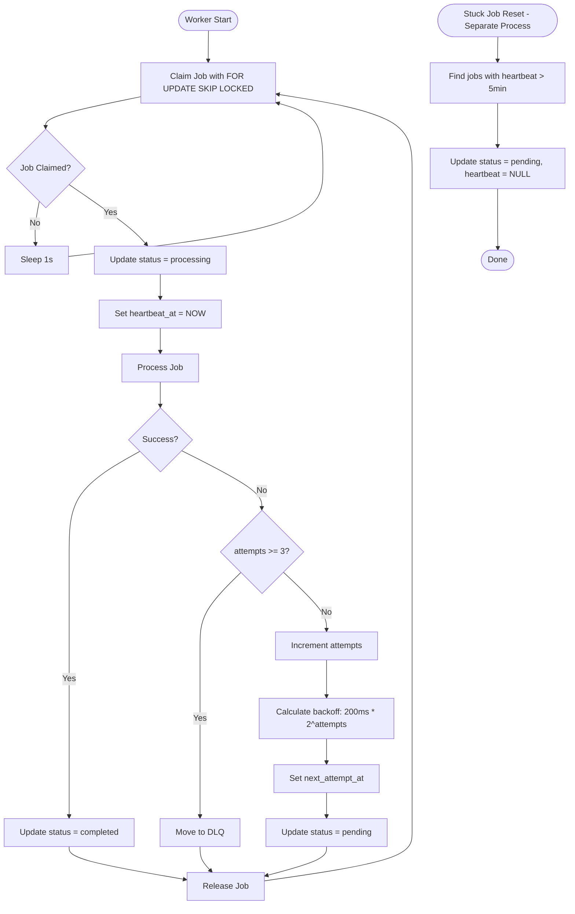
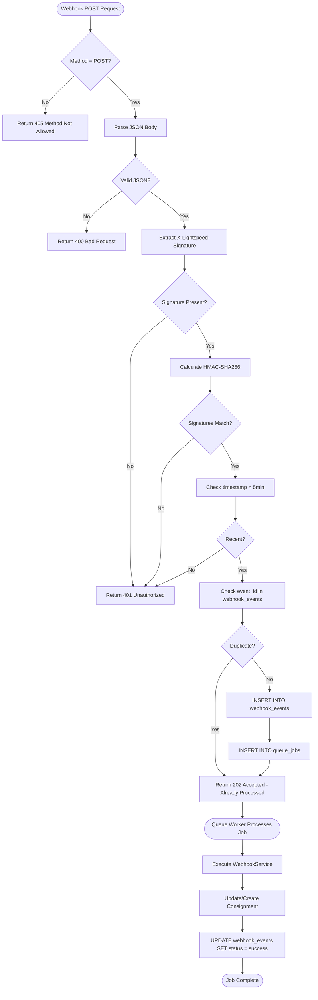
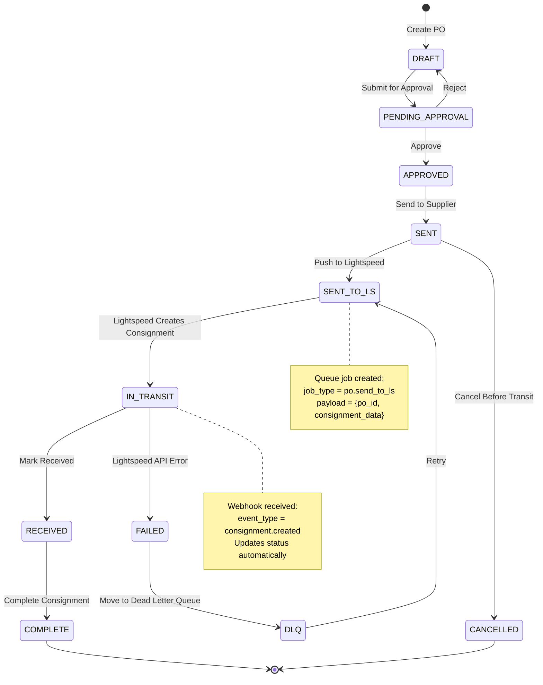

# Consignments Runbook

**Version:** 2.0.0  
**Last Updated:** November 2, 2025

## Quick Reference

### Service Status
```bash
# Check queue worker
sudo systemctl status consignments-queue.service

# Check logs
tail -f /var/www/modules/consignments/logs/queue-worker.log
tail -f /var/www/modules/consignments/logs/poller.log

# Admin dashboard
https://staff.vapeshed.co.nz/consignments/admin/dashboard.php
```

### Emergency Contacts
- **On-Call:** Pearce Stephens (021-XXX-XXXX)
- **Database:** DBA Team
- **Hosting:** Cloudways Support

---

## Architecture Diagrams

### Queue Worker Flow



### Webhook Processing Flow



### Transfer Lifecycle (PO Example)



---

## Common Issues & Solutions

### 1. Webhooks Not Processing

**Symptoms:**
- Webhook events showing as "pending" in dashboard
- webhook_events table filling up
- Consignments not syncing from Lightspeed

**Diagnosis:**
```bash
# Check webhook stats
mysql -u consignments_user -p -e "
  SELECT status, COUNT(*) 
  FROM consignments_prod.webhook_events 
  WHERE received_at > DATE_SUB(NOW(), INTERVAL 1 HOUR)
  GROUP BY status;"

# Check recent webhook errors
tail -100 /var/www/modules/consignments/logs/webhooks.log | grep ERROR
```

**Solutions:**

1. **Invalid HMAC signature:**
```bash
# Verify secret matches Lightspeed
grep LS_WEBHOOK_SECRET /var/www/modules/consignments/.env

# Test webhook manually
curl -X POST https://staff.vapeshed.co.nz/consignments/public/webhooks/lightspeed.php \
  -H "X-Lightspeed-Signature: sha256=$(echo -n '{"test":true}' | openssl dgst -sha256 -hmac 'YOUR_SECRET' | cut -d' ' -f2)" \
  -H "Content-Type: application/json" \
  -d '{"event_id":"test_123","event_type":"consignment.created","created_at":"2025-11-02T10:00:00Z","data":{}}'
```

2. **Rate limiting:**
```bash
# Check rate limit hits
mysql -u consignments_user -p -e "
  SELECT source_ip, COUNT(*) as requests
  FROM consignments_prod.webhook_events
  WHERE received_at > DATE_SUB(NOW(), INTERVAL 1 MINUTE)
  GROUP BY source_ip
  HAVING requests > 100;"

# Temporarily increase limit (edit public/webhooks/lightspeed.php)
# Or whitelist Lightspeed IPs
```

3. **Queue not processing:**
- See "Queue Worker Stuck" section below

---

### 2. Queue Worker Stuck

**Symptoms:**
- Jobs stuck in "processing" status
- queue_jobs table growing
- Transfers not updating in Lightspeed

**Diagnosis:**
```bash
# Check queue stats
mysql -u consignments_user -p -e "
  SELECT 
    status, 
    COUNT(*) as count,
    MAX(created_at) as oldest
  FROM consignments_prod.queue_jobs
  GROUP BY status;"

# Check stuck jobs (heartbeat >5min old)
mysql -u consignments_user -p -e "
  SELECT id, job_type, heartbeat_at, TIMESTAMPDIFF(MINUTE, heartbeat_at, NOW()) as minutes_stuck
  FROM consignments_prod.queue_jobs
  WHERE status = 'processing'
    AND heartbeat_at < DATE_SUB(NOW(), INTERVAL 5 MINUTE)
  LIMIT 10;"
```

**Solutions:**

1. **Worker crashed:**
```bash
# Check worker status
sudo systemctl status consignments-queue.service

# Check for PHP errors
tail -100 /var/www/modules/consignments/logs/queue-worker-error.log

# Restart worker
sudo systemctl restart consignments-queue.service
```

2. **Reset stuck jobs manually:**
```bash
mysql -u consignments_user -p consignments_prod -e "
  UPDATE queue_jobs
  SET status = 'pending', heartbeat_at = NULL
  WHERE status = 'processing'
    AND heartbeat_at < DATE_SUB(NOW(), INTERVAL 5 MINUTE);"
```

3. **Database connection issues:**
```bash
# Test connection
php -r "
  require '/var/www/modules/consignments/bootstrap.php';
  \$pdo = getDbConnection();
  echo 'Connection OK';
"

# Check MySQL process list
mysql -u root -p -e "SHOW PROCESSLIST;"

# Check for locks
mysql -u root -p -e "SHOW ENGINE INNODB STATUS\G" | grep -A 20 "TRANSACTIONS"
```

---

### 3. Jobs in Dead Letter Queue

**Symptoms:**
- Jobs appearing in `queue_jobs_dlq` table
- Repeated failures for same job type
- DLQ counter increasing in dashboard

**Diagnosis:**
```bash
# Check DLQ contents
mysql -u consignments_user -p -e "
  SELECT 
    job_type, 
    COUNT(*) as count,
    MIN(failed_at) as oldest_failure
  FROM consignments_prod.queue_jobs_dlq
  GROUP BY job_type
  ORDER BY count DESC;"

# Get specific error details
mysql -u consignments_user -p -e "
  SELECT id, job_type, error_message, payload
  FROM consignments_prod.queue_jobs_dlq
  ORDER BY failed_at DESC
  LIMIT 5\G"
```

**Solutions:**

1. **Lightspeed API errors:**
```bash
# Common: Invalid consignment data
# Fix: Update payload, retry job
mysql -u consignments_user -p consignments_prod -e "
  UPDATE queue_jobs_dlq
  SET payload = JSON_SET(payload, '$.consignment.outlet_id', 'CORRECT_ID')
  WHERE id = 123;"

# Retry via admin dashboard or CLI:
curl -X POST https://staff.vapeshed.co.nz/consignments/admin/api/retry-job.php \
  -H "Content-Type: application/json" \
  -d '{"dlq_id": 123}'
```

2. **Network timeouts:**
```bash
# Increase timeout in LightspeedClient
# Edit: infra/Lightspeed/LightspeedClient.php
# Change: 'timeout' => 30 (from 10)
```

3. **Bulk retry all DLQ jobs:**
```bash
php << 'EOF'
<?php
require '/var/www/modules/consignments/bootstrap.php';
$pdo = getDbConnection();

$stmt = $pdo->query("SELECT id FROM queue_jobs_dlq ORDER BY failed_at DESC LIMIT 50");
$dlqIds = $stmt->fetchAll(PDO::FETCH_COLUMN);

foreach ($dlqIds as $dlqId) {
    // Move back to queue
    $pdo->beginTransaction();
    $job = $pdo->prepare("SELECT * FROM queue_jobs_dlq WHERE id = ?")->execute([$dlqId])->fetch();
    $pdo->prepare("INSERT INTO queue_jobs (job_type, payload, priority, status) VALUES (?, ?, ?, 'pending')")
        ->execute([$job['job_type'], $job['payload'], $job['priority']]);
    $pdo->prepare("DELETE FROM queue_jobs_dlq WHERE id = ?")->execute([$dlqId]);
    $pdo->commit();
    echo "Retried job $dlqId\n";
}
EOF
```

---

### 4. Sync Falling Behind

**Symptoms:**
- Cursor not advancing
- Consignments missing from system
- Large gap between Lightspeed and local data

**Diagnosis:**
```bash
# Check cursor position
mysql -u consignments_user -p -e "
  SELECT cursor_type, last_processed_id, updated_at
  FROM consignments_prod.sync_cursors;"

# Check poller logs
tail -200 /var/www/modules/consignments/logs/poller.log | grep ERROR

# Compare counts (Lightspeed vs local)
# Get Lightspeed count via API, compare with:
mysql -u consignments_user -p -e "
  SELECT COUNT(*) FROM consignments_prod.queue_consignments;"
```

**Solutions:**

1. **Poller not running:**
```bash
# Check cron
crontab -l | grep poll-ls-consignments

# Run manually with verbose output
cd /var/www/modules/consignments
php bin/poll-ls-consignments.php --limit=100
```

2. **API rate limit hit:**
```bash
# Slow down polling
# Edit crontab: */5 → */10 (every 10 minutes instead of 5)

# Or increase page size (fewer requests)
php bin/poll-ls-consignments.php --limit=200
```

3. **Full re-sync:**
```bash
# Reset cursor (WARNING: Will re-process all consignments)
mysql -u consignments_user -p consignments_prod -e "
  UPDATE sync_cursors SET last_processed_id = 0 WHERE cursor_type = 'consignments';"

# Run full sync
php bin/poll-ls-consignments.php --full
```

---

### 5. Photo Uploads Failing

**Symptoms:**
- Receiving service returns errors
- Photos not appearing in evidence table
- 500 errors on upload endpoint

**Diagnosis:**
```bash
# Check upload directory permissions
ls -la /var/www/modules/consignments/uploads/receiving/

# Check disk space
df -h /var/www/

# Check PHP upload limits
php -i | grep -E "(upload_max_filesize|post_max_size|max_file_uploads)"

# Check recent upload errors
tail -100 /var/www/modules/consignments/logs/receiving.log | grep ERROR
```

**Solutions:**

1. **Permission issues:**
```bash
# Fix permissions
sudo chown -R www-data:www-data /var/www/modules/consignments/uploads/
sudo chmod -R 755 /var/www/modules/consignments/uploads/
```

2. **Disk space full:**
```bash
# Check usage
du -sh /var/www/modules/consignments/uploads/receiving/*

# Archive old uploads
cd /var/www/modules/consignments/uploads/receiving
find . -type f -mtime +90 -exec mv {} /archive/receiving/ \;
```

3. **PHP limits too low:**
```bash
# Edit PHP config
sudo nano /etc/php/8.2/fpm/php.ini

# Increase limits:
upload_max_filesize = 10M
post_max_size = 12M
max_file_uploads = 20

# Restart PHP-FPM
sudo systemctl restart php8.2-fpm
```

---

## Maintenance Procedures

### Daily Checks (5 minutes)
```bash
# 1. Check admin dashboard
# Visit: https://staff.vapeshed.co.nz/consignments/admin/dashboard.php
# Verify: Queue health green, no errors in log

# 2. Check DLQ
mysql -u consignments_user -p -e "SELECT COUNT(*) FROM consignments_prod.queue_jobs_dlq;"
# Expected: 0 (or investigate if >0)

# 3. Check worker status
sudo systemctl status consignments-queue.service | grep "Active:"
# Expected: active (running)
```

### Weekly Checks (15 minutes)
```bash
# 1. Review slow queries
mysql -u consignments_user -p consignments_prod -e "
  SELECT * FROM information_schema.processlist 
  WHERE time > 5 AND command != 'Sleep';"

# 2. Check table sizes
mysql -u consignments_user -p -e "
  SELECT 
    table_name,
    ROUND(((data_length + index_length) / 1024 / 1024), 2) as size_mb
  FROM information_schema.tables
  WHERE table_schema = 'consignments_prod'
  ORDER BY size_mb DESC
  LIMIT 10;"

# 3. Archive old webhook events
mysql -u consignments_user -p consignments_prod -e "
  DELETE FROM webhook_events WHERE received_at < DATE_SUB(NOW(), INTERVAL 90 DAY) LIMIT 1000;"

# 4. Rotate logs
cd /var/www/modules/consignments/logs
gzip queue-worker.log.$(date +%Y%m%d)
mv queue-worker.log queue-worker.log.$(date +%Y%m%d)
touch queue-worker.log
```

### Monthly Checks (30 minutes)
```bash
# 1. Database optimization
mysql -u consignments_user -p consignments_prod -e "
  OPTIMIZE TABLE queue_jobs, webhook_events, queue_consignments;"

# 2. Index analysis
mysql -u consignments_user -p consignments_prod -e "
  SELECT 
    table_name,
    index_name,
    cardinality
  FROM information_schema.statistics
  WHERE table_schema = 'consignments_prod'
  ORDER BY table_name, index_name;"

# 3. Review and update dependencies
cd /var/www/modules/consignments
composer outdated
# Update if necessary: composer update (test in staging first!)

# 4. Security audit
grep -r "password\|secret" app/ infra/ --include="*.php" | grep -v ".env"
# Should return no results
```

---

## Performance Optimization

### Slow Queue Processing
```bash
# Add index on queue_jobs
mysql -u consignments_user -p consignments_prod -e "
  CREATE INDEX idx_queue_claim ON queue_jobs(status, priority DESC, created_at ASC);"

# Increase worker concurrency (if CPU allows)
# Edit: /etc/systemd/system/consignments-queue.service
# Add multiple instances or use --workers=N flag
```

### Slow Webhook Endpoint
```bash
# Add index on webhook_events
mysql -u consignments_user -p consignments_prod -e "
  CREATE INDEX idx_webhook_lookup ON webhook_events(event_id, received_at);"

# Enable PHP OpCache
sudo nano /etc/php/8.2/fpm/php.ini
# Set: opcache.enable=1
sudo systemctl restart php8.2-fpm
```

---

## Disaster Recovery

### Database Backup
```bash
# Daily backup (add to cron)
mysqldump -u consignments_user -p consignments_prod \
  --single-transaction \
  --routines \
  --triggers \
  | gzip > /backups/consignments_$(date +%Y%m%d).sql.gz
```

### Restore from Backup
```bash
# Stop services
sudo systemctl stop consignments-queue.service

# Restore database
gunzip < /backups/consignments_20251102.sql.gz | \
  mysql -u consignments_user -p consignments_prod

# Restart services
sudo systemctl start consignments-queue.service
```

---

## Monitoring Alerts

### Set Up Email Alerts
```bash
# Install monitoring script
cat > /usr/local/bin/consignments-health-check.sh << 'EOF'
#!/bin/bash
ERRORS=$(mysql -u consignments_user -pPASS consignments_prod -se "
  SELECT COUNT(*) FROM queue_jobs WHERE status='failed' AND updated_at > DATE_SUB(NOW(), INTERVAL 1 HOUR);")

if [ "$ERRORS" -gt 10 ]; then
  echo "Alert: $ERRORS failed jobs in last hour" | mail -s "Consignments Alert" admin@example.com
fi
EOF

chmod +x /usr/local/bin/consignments-health-check.sh

# Add to cron (every hour)
0 * * * * /usr/local/bin/consignments-health-check.sh
```

---

## Change Log

- **2025-11-02:** Initial runbook for v2.0.0
